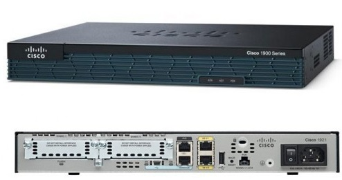

# Ağ Cihazları

Bir bilgisayar ağında, her biri ayrı bir görevden sorumlu olan ağ aygıtları vardır. Bir bilgisayar ağında bu bileşenler olmadan ağ görevini yerine getiremez. Bu nedenle, ağ cihazlarının görevlerini ve yeteneklerini bilmek, ağdaki sorunları çözmeye ve güvenlik ihlallerini anlamaya olanak tanır. Bu sayede hızlı aksiyon alınarak çözüme ulaşılır. Bu bölümünde bir IT ağındaki ağ cihazları hakkında bilgiler ele alınacaktır.

### **Switch**

Switch, OSI referans modeline göre 2. katmanda çalışan ağ cihazlarından biridir. Ancak, daha yönetilebilir özelliklere sahip bazı anahtarlar, OSI referans modeline göre 3. katmanda çalışır. Anahtar, ara bağlantı cihazıdır ve ağa bağlanmak isteyen düğümleri bağlamak için kullanılır. Üzerindeki port sayısına göre boyutları değişiklik gösterebilir.

<figure><figcaption></figcaption></figure>

Yukarıda görüldüğü gibi switch cihazı kaynak porttan gelen verileri sadece hedef porta ileterek network performansını olumsuz etkilemeyecek bir veri iletimi sağlamaktadır. Güvenlik açısından iki tarafa ait verilerin üçüncü şahıslara ulaşmasını engeller, bu sayede veri güvenliğini bir anlamda arttırır.

Yukarıda görüldüğü gibi switch cihazı kaynak porttan gelen verileri sadece hedef porta ileterek network performansını olumsuz etkilemeyecek bir veri iletimi sağlamaktadır. Güvenlik açısından iki tarafa ait verilerin üçüncü şahıslara ulaşmasını engeller, bu sayede veri güvenliğini bir anlamda arttırır.

<figure><figcaption></figcaption></figure>

### **Router**

Yönlendirici, OSI referans modeline göre 3. katmanda çalışan ağ ekipmanlarından biridir. Yönlendirici, bir işletim sistemi (IOS - Ağlar Arası İşletim Sistemi) içeren, oldukça gelişmiş özelliklere sahip bir paket yönlendirme cihazıdır. İki bilgisayar ağı arasına yerleştirilerek kullanılan ağ ekipmanıdır. Örneğin LAN-LAN bağlantılarında ve WAN-LAN bağlantılarında sıklıkla kullanılır. Yönlendiricinin en temel görevi paket yönlendirmedir ve bu cihaz sayesinde ağlar birbirinden ayrılır (segmentasyon). Yani bilgisayar ağlarını birbirinden ayıran cihazlardan biridir. Yapılandırılabilir bir cihazdır.

<figure><figcaption></figcaption></figure>

### **Hub**

Hub, OSI referans modeline göre katman 1'de çalışan ağ donanımlarından biridir. Oldukça basit bir yapıya sahip olan hub cihazı, ağa bağlanmak isteyen bilgisayarları birbirine bağlamak için kullanılan cihazlardan biridir.

<figure><figcaption></figcaption></figure>

Switch'e çok benziyor ancak bazı önemli farklılıkları var. Örneğin yukarıda görüldüğü gibi hub cihazı kaynak ve hedef ayrımı yapabilen bir cihaz değildir. Herhangi bir porttan gelen verileri tüm portlara bağlı bilgisayarlara gönderir. Bu durum veri güvenliği açısından istenmeyen ve sakıncalı bir durumdur. Geçmişte sıklıkla kullanılsa da günümüzde tercih edilen bir cihaz değildir.

<figure><figcaption></figcaption></figure>

### **Repeater**

Repeater, OSI referans modeline göre katman 1'de çalışan ağ ekipmanlarından biridir. Tekrarlayıcı cihazda sadece 2 port vardır. Bu portlar gelen sinyali giden sinyale çevirir ve hedefe iletir. Üzerindeki zayıf sinyalleri güçlendirerek daha uzun mesafelere veri iletebilmesini sağlar. Bir hub'a benzer bir cihazdır, ancak bir hub kadar çok bağlantı noktasına sahip değildir.

<figure><figcaption></figcaption></figure>

### **Bridge**

Köprü, OSI referans modeline göre katman 2'de çalışan ağ donanımlarından biridir. Köprü, iki bilgisayar ağını birbirine bağlayarak paket yönlendirme gerçekleştirir. Yönlendiriciye benzer bir görevi olmasına rağmen, yönlendiriciden daha az bağlantı noktasına sahip çok basit bir cihazdır. Ayrıca 2. katmanda çalışarak yönlendiriciden ayrılır. Köprü, LAN'dan LAN'a bağlantılarda kullanılabilir.

<figure><figcaption></figcaption></figure>

### **Modem**

Modemler genellikle switch gibi bazı cihazların özelliklerinin bir araya toplandığı küçük boyutlu ağ ekipmanlarıdır. Küçük bir işletim sistemi içerir. Genellikle ev ağlarında internet ortamına erişmek için kullanılır. Üzerinde bir veya daha fazla bağlantı noktası olabilir. Ayrıca kablosuz destekli modemlerde modem ile birlikte kablosuz cihazları kullanarak internet bağlantısı sağlamak mümkündür.

### **Güvenlik Duvarı**

Güvenlik duvarı, OSI referans modeline göre 4. katmanda çalışan ağ ekipmanlarından biridir. Güvenlik duvarı, güvensiz bir ağ olarak kabul edilen internet ile mevcut ağ arasında bulunan ağ donanımı için hayati önem taşır. Ağın güvenliğini sağlamak için gerekli temel ağ ekipmanlarından biri olan güvenlik duvarının görevi, belirli kurallara göre trafiği engellemek veya izin vermektir. Pek çok türü olmasına rağmen en çok kullanılan ve bilinen güvenlik duvarı türü donanımsal ağ güvenlik duvarı cihazlarıdır. Yalnızca bir güvenlik duvarı aygıtına sahip olmak, ağı dış tehditlere karşı korumak için yeterli değildir. Çünkü saldırganlar güvenlik duvarları ile ağlara bile sızabilir. Güvenlik duvarı doğru yapılandırılmalıdır. Eksik ve hatalı güvenlik duvarı yapılandırmaları ağ performansını olumsuz etkileyebilir,

<figure><figcaption></figcaption></figure>

### **Gateway**

Gateway, OSI modeline göre her katmanda çalışabilen ağ ekipmanlarından biridir. Ağ geçidi, iki ağ arasında yer alan ağlar arası iletişimi sağlayan bir ağ bileşenidir. Başka bir deyişle, ağları birbirine bağlar. İşlevsel olarak yönlendirici cihazlara benzese de her katmanda çalışabilme özelliği ile yönlendiricilerden ayrılmaktadır. Ayrıca sadece donanımsal değil yazılımsal ağ geçidi türleri de bulunmaktadır. Ağ geçitleri, ağdaki diğer düğümler için bir ağ geçididir. Bu cihaz sayesinde ağ dışına çıkıp başka bir ağdaki bir düğüm ile iletişim kurabilirler.

<figure><figcaption></figcaption></figure>

