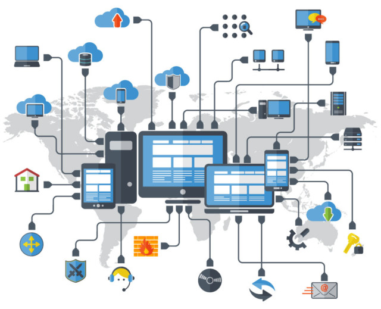

# Ağ Temellerine Giriş

### **Bilgisayar Ağı Nedir?**

İnsanlar ve dijital cihazlar kendi aralarında birbirleriyle iletişim kuran varlıklardır. İnsanların bir çemberi olduğu gibi, dijital dünyadaki cihazların da bir çemberi var.

Dijital dünyada cihazların oluşturduğu bu ortama "Bilgisayar Ağı" adı verilir. Yani en az iki cihazın birbiriyle haberleştiği yapıya "Bilgisayar Ağı" denilebilir.

<figure><figcaption></figcaption></figure>

### **Bilgisayar Ağlarının Amaçları**

Bilgisayar ağları gelişen teknoloji ile birlikte çok farklı amaçlar için kullanılabilir hale gelmiştir. Bilgisayar ağlarının başlıca kullanım alanları şunlardır:\

* Görüntü ve ses aktarımının sağlanması (Chat ve online toplantılar)
* Donanım paylaşımı (Yazıcı paylaşımı)
* Dosya, veri ve bilgi paylaşımı
* Yazılım paylaşımı
* merkezi yönetim
* Destek

### **ARPANET ve İnternet**

İnternet geçmişten günümüze birçok gelişim sürecinden geçmiştir. İlk ortaya çıktığında bugünkü kadar yaygın ve büyük değildi. Kullanılabilecek kitle çok sınırlıydı ve daha çok askeri amaçlarla kullanılıyordu. İleri Araştırma Projeleri Ajans Ağı (ARPANET), internetin temeli sayılan bir bilgisayar ağıdır. İnternet teknolojilerinin temeli ARPANET'te kullanılan teknolojilerdir. 1969'da ARPANET, ABD'deki üç üniversite ağına bağlanarak bir bilgisayar ağı oluşturdu. Daha sonra bu yapı genişledi ve daha da büyüdü. Aşağıdaki görsel 1969 ve 1982 yıllarında ARPANET'i ve bağlı olduğu bilgisayar ağlarını göstermektedir.

<figure><figcaption>
arpanet map
</figcaption></figure>

Daha geniş bir coğrafi alana yayılan bu ağ, günümüze kadar gelmiş ve interneti oluşturmuştur.

\

\
\
