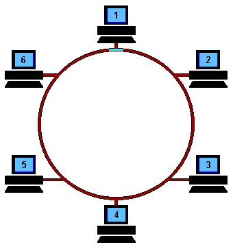
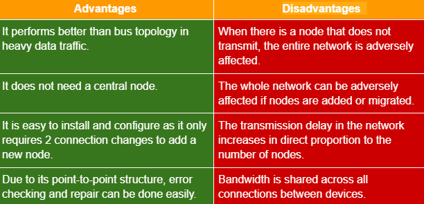
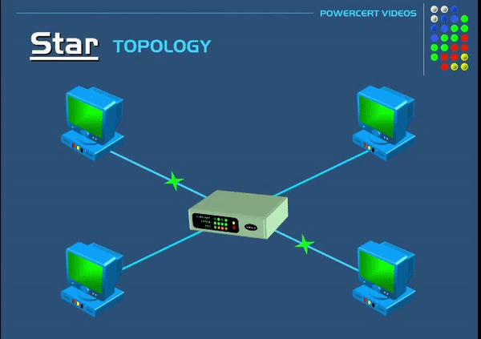
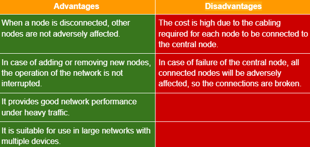
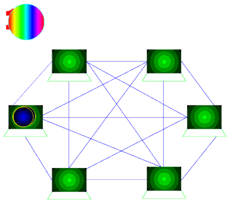
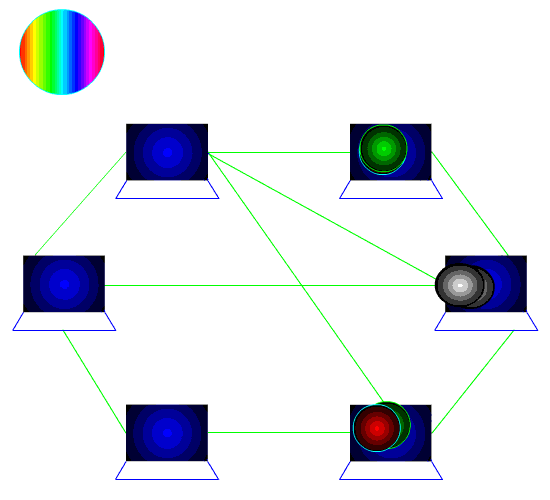
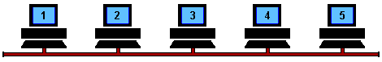
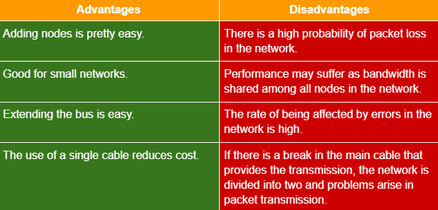
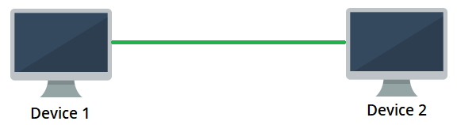
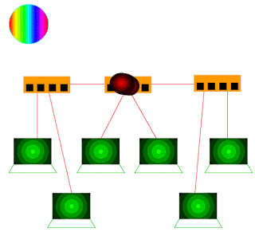

# Ağ Topolojileri

Ağ topolojisi, bir ağın fiziksel veya mantıksal yapısını anlamak için oluşturulan görsel haritalardır. Ağdaki cihazların ve kabloların konumları, ağ topolojisini belirleyen faktörler arasındadır. Bir ağ topolojisine sahip olmanın birçok faydası vardır. Örneğin, ağdaki bir cihazın görevini yerine getirememesi durumunda ağdaki diğer hangi cihaz(lar)ın etkileneceğini görmek mümkündür. Büyük bir ağın ağ topolojisine bakacak olursak, ağdaki alt ağları ve bağlı olduğu cihazları görmek mümkündür.

Ağ topolojisi 2 türe ayrılır:

### **Fiziksel Topoloji**

Ağdaki tüm cihazların ve bileşenlerin tam konumlarına göre çizildiği bir topoloji türüdür. Bu topolojiye bakıldığında hangi kablolamanın hangi yollar ve cihazlar üzerinden yapıldığı görülmektedir. Çizimde görülenin fiziksel bir karşılığı vardır. Örneğin, A cihazından B cihazına giden yolda bir ağ cihazı varsa, bu cihaz fiziksel topolojide görülür.

### **Mantıksal Topoloji**

Fiziksel topoloji gibi topolojide cihazların tam yerini göstermez. Genellikle fiziksel topolojiden daha az öğe içerir. Çünkü mantıksal topolojide veri akışı önemlidir. Örneğin, A cihazından B cihazına giden veriler, A cihazı ile B cihazı arasında C cihazı üzerinden geçiyorsa topolojiye dahil edilmeyebilir ve C cihazının üzerinde görüntülenmesi gereken veriler üzerinde hiçbir etkisi yoktur. Bu topolojide cihazların fiziksel yerleşiminden çok veri akışının izlediği yol vurgulanmak istenmektedir.

Bazı topolojiler aşağıdaki başlıklarda açıklanmıştır:

### **Halka Topolojisi**

Kapalı döngü mantığında çalışır. Gönderilen veri, hedefe ulaşana kadar halka etrafında tek yönde hareket eder. Her düğüm gelen veriyi üzerinden geçirir ve hedefe ulaşmasını sağlar. Düğümler arasında hiyerarşik bir ilişki yoktur.

<figure><figcaption></figcaption></figure>

<figure><figcaption></figcaption></figure>

### **Yıldız topolojisi**

Star topolojisindeki her düğüm bir merkezi düğüme bağlıdır. Tüm veri akışı merkezi düğüm üzerinden yapılır. Yıldız topolojisi, en yaygın bilgisayar ağı topolojilerinden biridir.

<figure><figcaption></figcaption></figure>

<figure><figcaption></figcaption></figure>

### **Ağ Topolojisi**

Merkezi bir düğümün olmadığı ve her düğümün diğerine doğrudan bağlanabildiği bir ağ topolojisidir. Mesh topolojisi, büyük ağlar için uygun bir topoloji değildir. 2 türe ayrılır:

### **Tam örgü**

Full-Mesh topolojisinde, ağdaki her bir düğüm diğer tüm düğümlere ayrı ayrı kablolanarak bağlanır. Bu topolojide, iki düğüm arasındaki bağlantının kesilmesi olası değildir. Çünkü alternatif bağlantı yolları var.

<figure><figcaption></figcaption></figure>

### **Kısmi Ağ**

Kısmi Ağ topolojisinde, her düğüm diğer tüm düğümlere doğrudan bağlı olmasa da, büyük ölçüde birbirine bağlıdır. Tıpkı Full-Mesh topolojisinde olduğu gibi, bağlantının kesilmesi durumunda hedef düğüme ulaşmanın alternatif yolları vardır.

<figure><figcaption></figcaption></figure>

### **Otobüs topolojisi**

Bus topolojisi, düğümlerin ortak bir yol üzerinde konumlandığı ve bu yol üzerinde çift yönlü bağlantı ile veri iletiminin yapıldığı bir topolojidir. Bus topolojisinde her düğüm kendisine ait olmasa bile iletilen her veriyi alır. Düğümler arasında hiyerarşik bir düzen olmadığı için iletim önceliği yoktur.

<figure><figcaption></figcaption></figure>

<figure><figcaption></figcaption></figure>

### **Noktadan Noktaya Topoloji**

Noktadan noktaya topoloji en basit topolojidir ve birbirine bağlı iki düğümden oluşur. Örneğin, iki telefon arasında geçen bir çağrı, noktadan noktaya bir topoloji oluşturur veya iki bilgisayar arasındaki doğrudan bağlantı, noktadan noktaya bir topoloji oluşturur.

<figure><figcaption></figcaption></figure>

### **Ağaç Topolojisi**

Ağaç topolojisi, yıldız ve veri yolu topolojisini birbirine bağlayarak oluşturulan hibrit bir ağ topolojisidir. Ağaç topolojisi hiyerarşik bir düzene sahiptir ve her düğüm herhangi bir sayıda alt düğüme sahip olabilir.

<figure><figcaption></figcaption></figure>
