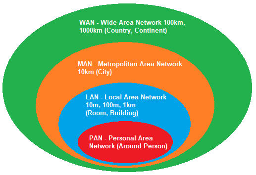
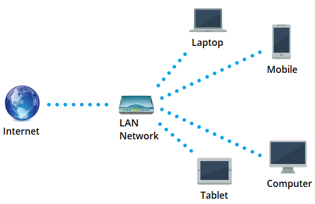
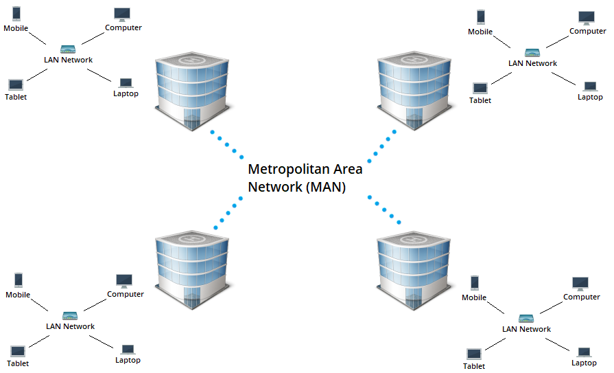
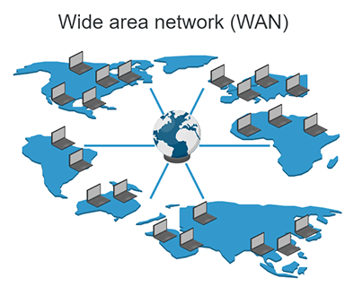
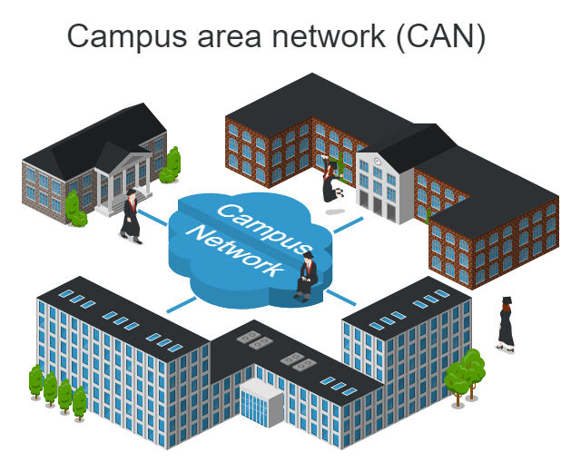

# Ağ Türleri

Bilgisayar ağları boyutlarına göre coğrafi olarak birçok gruba ayrılır. İçinde milyonlarca cihaz bulunan büyük ağlar olabileceği gibi 2-3 cihazdan oluşan küçük ağlar da olabilir. Aşağıdaki resimde, bazı bilgisayar ağları türleri boyuta göre gösterilmektedir.

<figure><figcaption></figcaption></figure>

### **Kişisel Alan Ağı (PAN)**

Kişisel Alan Ağı (PAN), çok kısa mesafeleri (örneğin 10 metreye kadar) kapsayan, minimum ve az sayıda cihazdan oluşan ağları ifade eder. Örneğin, Bluetooth aracılığıyla bağlanan bir mobil cihaz ve kablosuz kulaklık bu tür ağlara örnektir. Bu küçük ağda sadece 2 cihaz var: Bir mobil cihaz ve bir kablosuz kulaklık.

<figure><figcaption></figcaption></figure>

### **Yerel Alan Ağı (LAN)**

Yerel Alan Ağı (LAN), PAN'dan daha geniş bir alana sahiptir. İçindeki cihaz sayısı çok daha fazla olabilir. En sık kullanılan ve bulunan ağ türüdür. Bazen 2 cihazlı bir ağ LAN olarak da adlandırılabilir. Kapasite olarak 2'den çok daha fazla cihazı desteklemesi ve coğrafi olarak daha geniş bir alana yayılmış olması LAN tipi bir ağ olduğunu gösterir. Örneğin ev ağları ve bina içindeki paylaşımlı ağlar LAN'a örnek olarak verilebilir.

<figure><figcaption></figcaption></figure>

### **Metropolitan Alan Ağı (MAN)**

Metropolitan Alan Ağı (MAN), birçok LAN bilgisayar ağının birbirine bağlı olduğu, coğrafi olarak şehir boyutunda bir bilgisayar ağıdır. Ağları fiber optik kablolarla birbirine bağlar.

<figure><figcaption></figcaption></figure>

### **Geniş Alan Ağı (WAN)**

Geniş Alan Ağı (WAN), bilgisayar ağları arasında en geniş coğrafi alana sahip bilgisayar ağıdır. Bu bilgisayar ağı o kadar büyük ki kıtaları bile kapsayabilir. Diğer tüm bilgisayar ağlarını bünyesinde barındırır. Bu bilgisayar ağının bir örneği "İnternet" dir. Dünyadaki kıtalararası fiber-optik altyapıları görmek için aşağıdaki adres kullanılabilir:

Denizaltı Kablo Haritası: [submarinecablemap.com](https://submarinecablemap.com/)\

<figure><figcaption></figcaption></figure>

### **Kampüs Alan Ağı (CAN)**

Kampüs Alanı Ağı (CAN), coğrafi olarak MAN'dan küçük ve LAN'dan daha büyük bir bilgisayar ağıdır. Bu bilgisayar ağı birkaç LAN içerebilir. Genellikle üniversitelerin, kurumların veya özel şirketlerin bilgisayar ağları bu bilgisayar ağlarına örnek olarak verilir.

<figure><figcaption></figcaption></figure>

