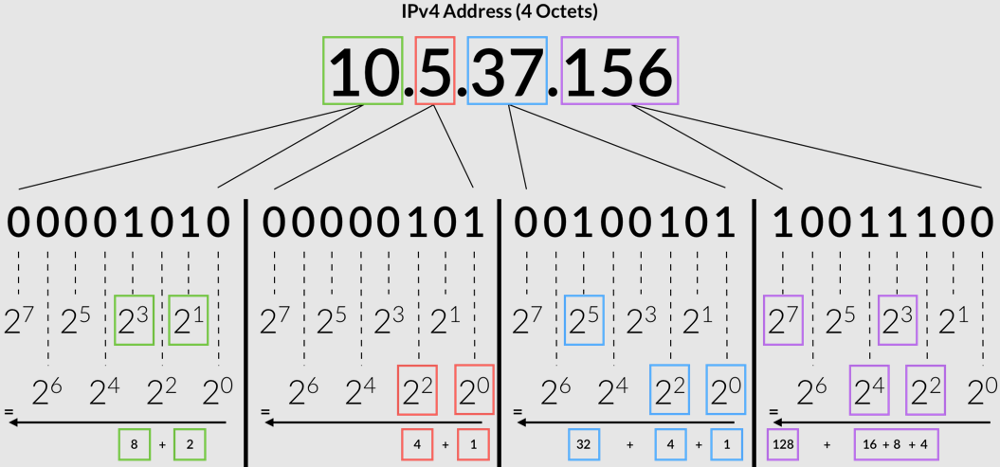
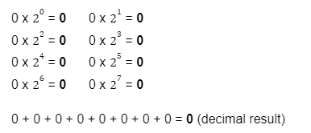
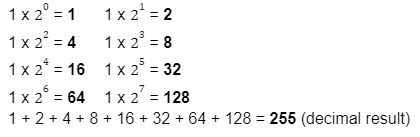
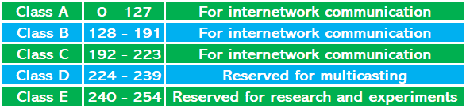
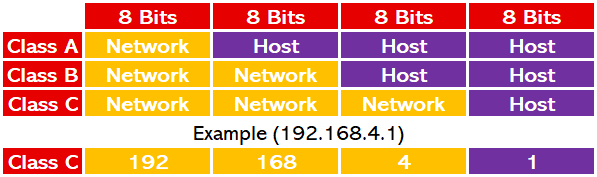
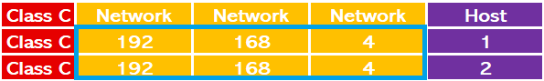
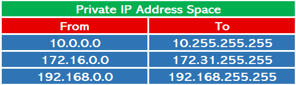

# IP Adresleme Mekanizması

TCP/IP bilgisayar ağları oluşturulurken öncelikle ağdaki her cihaza bir mantıksal adres (IP Adresi) atanmalıdır. Bu atama işlemlerine "IP Adresleme Mekanizması" adı verilir. Ağdaki bir cihaza IP adresi atanmamışsa, ağ içindeki veya dışındaki cihazlarla iletişim kuramaz.

### **IP Adresi nedir?**

IP Adresi, cihazın ağ adresinin kimliğidir. Bağlantı işlemleri IP adresleri kullanılarak gerçekleştirilir. IP adresleri IPv4 ve IPv6 olarak ikiye ayrılır. Her iki IP adresi türüne örnek olarak aşağıdaki IP adresleri verilebilir:

**IPv4:** 192.168.4.1\
**IPv6:** 2001:0db8:85a3:0000:0000:8a2e:0370:7334

### **IP Adresinin Yapısı**

IP adresi 4 bayttan (32 bit) oluşur. Her bayt arasına bir nokta konur ve ondalık gösterimle ifade edilir. Örneğin, aşağıdaki resim IP adresinin ikili gösterim ile ondalık gösterim arasında dönüşümünü göstermektedir:

<figure><figcaption></figcaption></figure>

Her bayt 8 bitten oluştuğu için her baytın minimum değeri alabilmesi için 8 bitlik değerin "0" (sıfır) olması gerekir. Benzer şekilde, maksimum değeri elde etmek için her bayt için 8 bitlik değerin "1" olması gerekir. Örneğin IP adresindeki her byte'ın alabileceği minimum ve maksimum değerleri hesaplayalım:

Minimum (İkili) : 00000000

<figure><figcaption></figcaption></figure>

Hesaplama sonucunda da görüldüğü gibi "00000000" ikili ifadesinin ondalık karşılığı "0" (sıfır)'dır.

Maksimum (İkili) : 11111111

<figure><figcaption></figcaption></figure>

Hesaplama sonucunda da görüldüğü gibi IP adresinin her byte'ı “0-255” arasında bir değer alabilmektedir.

### **IP Adresi Sınıfları**

IP adresleri 5 sınıfa ayrılmıştır. IP adresinin sınıfını öğrenmek için IP adresinin ilk byte'ına bakılır. Birinci baytın ondalık değerine göre aşağıdaki tablodan IP adresinin hangi sınıflara ait olduğu anlaşılır.

<figure><figcaption></figcaption></figure>

Bu IP adresine sahip cihazın hangi ağa dahil olduğunu IP adresinden öğrenmek mümkündür. Bu bilgiyi öğrenebilmek için öncelikle IP adresinin hangi sınıfa ait olduğunun bilinmesi gerekmektedir. Daha sonra aşağıdaki tablodaki “Network Bits” alanları kontrol edilir.

<figure><figcaption></figcaption></figure>

Örneğin "192.168.4.1" IP adresinin hangi sınıfa ait olduğunu ve ağ bitlerinin hangi byte olduğunu öğrenelim:

Adım 1: İlk baytın ondalık değerini kontrol edin: "192"\
Adım 2: Tabloya göre “192” değerinin hangi sınıfa ait olduğu öğrenilir: “C Sınıfı”\
Adım 3: Tabloya göre "C" sınıfına ait bir IP adresinin hangi baytlarının ağ bitlerine ait olduğunu kontrol etti: "ilk 3 bayt"

Edindiğimiz bilgilere göre ilk 3 byte'ı aynı olan IP adreslerinin aynı ağdaki cihazlara ait olduğu söylenebilir. Örneğin, “192.168.4.1” IP adresi ve “192.168.4.2” IP Adresi aynı ağ üzerindedir. Çünkü sadece host bitlerinin bulunduğu byte üzerinde değişiklik vardır. Ağ bitleri aynı değere sahiptir: 192.168.4.X

<figure><figcaption></figcaption></figure>

### **IPv6 nedir?**

Günümüzde internet ağına bağlı cihaz sayısı oldukça fazladır. Tüm bu cihazların bir IP adresine sahip olduğu düşünüldüğünde, IPv4 artık yeterli değildir. Bu nedenle bu sorunu çözmek için bazı teknolojiler (NAT) ve IPv6 geliştirilmiştir. IPv6 ile birlikte sınırlı sayıda adrese sahip olan IPv4 kullanımı azalmaya başlamış ve yerini IPv6'ya bırakmıştır. Aşağıdaki tabloda IPv4 ve IPv6 karşılaştırılmaktadır:

<figure><figcaption></figcaption></figure>

### **Özel IP Adresleri**

Bazı IP adresleri özel amaçlar için ayrılmıştır. Bu ayrılmış IP adresleri, özel ağlarda kullanılan IP adresleridir. Özel ağlar, doğrudan internete bağlı olmayan ve internete bir aracı ağ cihazı ile bağlanan ağlardır. Örneğin, ev ağları ve şirket içi ağlar. Ev içi ağlarda, modem cihazı internete bağlantı sağlar ve paket akışını yönetir. Modem cihazı, ev ağına bakan bir ağ arayüzüne ve internet tarafına bakan bir ağ arayüzüne sahiptir. Özel ağ olarak adlandırılan kısım, modem cihazının ev ağı arayüzünün bulunduğu kısımdır. Bu bölümdeki cihazların IP adresleri internet ortamında kullanılmayan ayrılmış IP adresleridir. Aşağıdaki tabloda özel IP adresi aralıkları gösterilmektedir:

<figure><figcaption></figcaption></figure>

### **Localhost nedir?**

Localhost, cihazın kendi ağ adresini belirten IP adresi aralığıdır. Cihazda yerel olarak çalışan hizmetlere erişmek için kullanılır. Genellikle "127.0.0.1" IP adresi olarak bilinir. Ancak bu amaçla “127.0.0.1 - 127.255.255.255” aralığındaki herhangi bir IP adresi kullanılabilir. Başka bir isim "geri döngü" adresidir.
