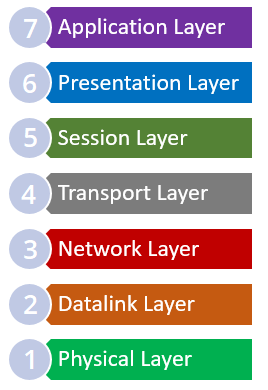

# OSI Reference Model

### **OSI Referans Modeli nedir?**

Open Systems Interconnection (OSI) referans modeli, ISO (International Organization of Standardization) tarafından 1978 yılında geliştirilmiştir. OSI modeli, farklı işletim sistemleri arasında iletişimi sağlamak için oluşturulmuş bir modeldir. Bu model ile ağ yapılarını anlamak daha kolay hale gelmiştir. Referans kalitedir ve katmanlı bir mimariye sahiptir. OSI modelindeki her katmanın ayrı görevleri vardır. Bu katmanlar arasında hiyerarşik bir düzen vardır ve her katman bir sonraki katmana hizmet eder. OSI modelinde katman sayısı 7'dir.

<figure><figcaption></figcaption></figure>

Veri iletimi bu katmanlar üzerinden gerçekleştirilir ve veriler kullanıcıya iletilir. OSI modelindeki her katman aşağıdaki başlıklar altında açıklanmıştır.

### **1.Fiziksel Katman**

Fiziksel katman, OSI modelindeki ilk katmandır. Bu katmanda, veriler iletişim kanalları boyunca bitler halinde iletilir. Fiziksel katman sadece verinin iletilmesinden sorumlu olduğu için ilettiği verinin türü ve ne olduğu hakkında herhangi bir bilgiye sahip değildir. Bu katman için veriler sıralı bit dizilerinden oluşur.

### &#x20;**2.Veri Bağlantısı Katmanı**

Veri bağlantısı katmanı, OSI modelindeki 2. katmandır. Bu katman, fiziksel katmandan gelen bitleri işler ve bir sonraki katmana gönderilmek üzere hazırlar. Bu katmandaki temel işlem fiziksel adreslemedir.

### &#x20; **3. Ağ Katmanı**

Ağ katmanı, OSI modelinde 3. katmandır. Ağ katmanı, verilerin hedef mantıksal adrese (IP Adresi) iletilmesinden sorumludur. Bu katmandaki temel işlem mantıksal adreslemedir.

### &#x20; **4. Aktarım Katmanı**

Taşıma katmanı, OSI modelinde 4. katmandır. Aktarım katmanı, iletim güvenliğinden sorumludur. Bu katman, verilerin hatasız bir şekilde iletilmesi için birçok ek kontrol sağlar ve bu kontroller sayesinde veri iletimi başarıyla gerçekleştirilir.

### &#x20; **5.Oturum Katmanı**

Oturum katmanı, OSI modelinde 5. katmandır. Oturum katmanı, sunum katmanının çalışması için gerekli servislerin sağlanmasından sorumludur. Bu katmandaki ana işlem oturum yönetimidir.

### &#x20; **6.Sunum Katmanı**

Sunum katmanı, OSI modelinde 6. katmandır. Sunum katmanı, verilerin görüntülendiği katmandır. İki iletişim düğümü, veri gösterimi için ortak bir dil kullanmalıdır. Bu katman sayesinde kullanılan dilde anlaşma yapılır.

### &#x20; **7.Uygulama Katmanı**

Uygulama katmanı, OSI modelindeki 7. ve son katmandır. Uygulama katmanı, kullanıcıya en yakın katmandır ve kullanıcı düzeyindeki OSI modelinde bulunan yapılara erişim sağlar.
