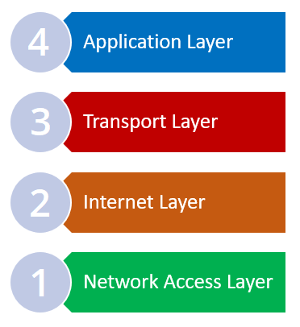
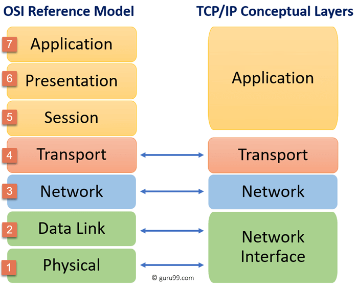

# TCP/IP Modeli

### **TCP/IP Modeli nedir?**

TCP/IP modeli, 1960'larda Savunma Bakanlığı (DoD) tarafından tasarlanmış ve geliştirilmiştir. TCP/IP modeli tanıtıldığında henüz bilgisayar ağ iletişiminde standartları belirleyen bir model yoktu. Bu model ile internet üzerinden ağ iletişiminin nasıl olması gerektiği belirlenmiştir. TCP/IP modeli katmanlı bir mimariye sahiptir ve 4 katmandan oluşur:

* Ağ Erişim Katmanı
* İnternet Katmanı
* Taşıma katmanı
* Uygulama katmanı

<figure><figcaption></figcaption></figure>

**Ağ Erişim Katmanı**

Ağ erişim katmanı, TCP/IP modelinde 1. katmandır. OSI referans modelinde 1. ve 2. katmanlara karşılık gelir. Bu katman, fiziksel erişimleri ve donanım kontrollerini içerir.\
\
**İnternet Katmanı**

İnternet katmanı, TCP/IP modelinde 2. katmandır. OSI referans modelindeki katman 3 ile benzer işlevlere sahiptir. Bu katmanda, ağ iletişim işlevleri mantıksal adresleme ile gerçekleştirilir.

\
**Taşıma katmanı**

Aktarım katmanı, TCP/IP modelinde 3. katmandır. OSI referans modelindeki katman 4 ile benzer işlevlere sahiptir. Bu katmanda veri iletimi yapılır ve iletişimin güvenilirliği sağlanır. Verilerin bozulmadan doğru bir şekilde aktarılıp aktarılmadığı bu katmanda yönetilir.\
\
**Uygulama katmanı**

Uygulama katmanı, TCP/IP modelinde 4. ve son katmandır. OSI referans modelinde 5, 6 ve 7. katmanlarda gerçekleştirilen tüm işlemleri kapsayan bir katmandır. Uygulama seviyesindeki kontroller ve işlemler bu katmanda yürütülür.\
\
**OSI Modeli ve TCP/IP Modeli**

OSI referans modeli ile TCP/IP modeli çok benzer modeller olsa da bazı noktalarda birbirlerinden farklılık gösterirler. TCP/IP modeli ilk ortaya çıktığında, bir standart olmayı hedeflemeden, zorunluluktan ortaya çıkmıştır. OSI referans modeli ise pratik kullanımı da dahil olmak üzere teoride olması gereken ideal ağ iletişimini tasarlamayı amaçlıyordu. TCP/IP modeli bazı protokollere dayalı olarak geliştirilmiştir. OSI modeli ise herhangi bir protokol üzerinde geliştirilmemiştir.

<figure><figcaption></figcaption></figure>

Yukarıdaki görsel, OSI referans modelindeki hangi katmanların, TCP/IP modelindeki hangi katmanlara görev ve protokoller açısından eşdeğer olduğunu göstermektedir.
