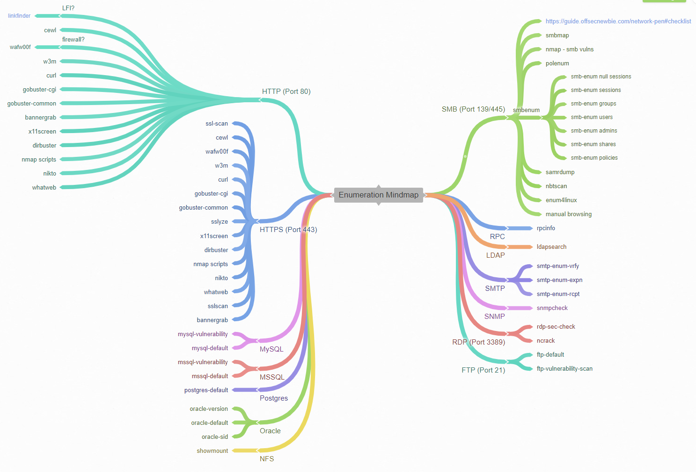

# Genel Metodoloji -1-

## Genel OSCP/CTF

<figure><figcaption><p>enumeration-mindmap</p></figcaption></figure>


[https://coggle.it/diagram/XepDvoXedGCjPc1Y/t/enumeration-mindmap
\
](https://coggle.it/diagram/XepDvoXedGCjPc1Y/t/enumeration-mindmap)


### Her açık port için TCP/UDP taraması


```
http://packetlife.net/media/library/23/common_ports.pdf
```

* Hizmet ve sürümlerini keşfedin
* Bilinen hizmet hatalarını bulun
* Yapılandırma sorunlarını bulun
* Nmap bağlantı noktası taraması

### Google

* Every error message
* Every URL path
* Every parameter to find versions/apps/bugs
* Every version exploit db
* Every version vulnerabil
*

### Uygulamanın yetkilendirmesi varsa

* User enum
* parola kaba-kuvvet (brute-force)
* varsayılan kimlik bilgileri..

## &#x20;Host Scanning

### Service Scanning

### WebApp

```
https://owasp.org/www-project-web-security-testing-guide/v42/
```

* Nikto
* dirb
* dirbuster
* wpscan
* dotdotpwn/LFI suite
* view source
* davtest/cadeavar
* droopscan
* joomscan
* LFI\RFI test
* Wapalyzer

### Linux\Windows

* snmpwalk -c public -v1 $ip 1
* smbclient -L //$ip
* smbmap -H $ip
* rpcinfo
* Enum4linux

## Exploitation

* Sürüm ve versiyon bilgilerini öğren
* Searchsploit
* Default Creds
* Creds previously gathered

