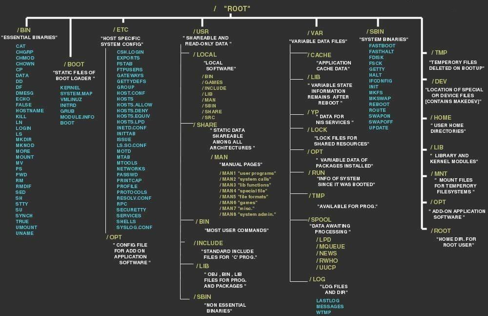

# 🐧 Everything Linux

<figure><figcaption><p>Linux Dosya Sistemi</p></figcaption></figure>

<figure><figcaption></figcaption></figure>

<figure><figcaption></figcaption></figure>

## Linux Privilege Escalation Examples

```
https://github.com/Tib3rius/Pentest-Cheatsheets/blob/master/privilege-escalation/linux/linux-examples.rst
```

## MindMap

<figure><figcaption><p>MindMap for PE</p></figcaption></figure>

### Çalıştırmak için yararlı komutlar

```
https://github.com/mubix/post-exploitation/wiki/Linux-Post-Exploitation-Command-List
```

### aranacak şeyler

* Yanlış yapılandırılmış hizmetler (cronjobs)
  * ayrıcalıklı bir kullanıcı olarak çalışan herhangi biri?
* Yanlış dosya izinleri (exportfs, sudo)
* Yanlış yapılandırılmış ortam ($PATH)
* Binary with SUID bit
* Bilinen güvenlik açıklarına sahip yazılım veya işletim sistemi
* Docker usergroup
